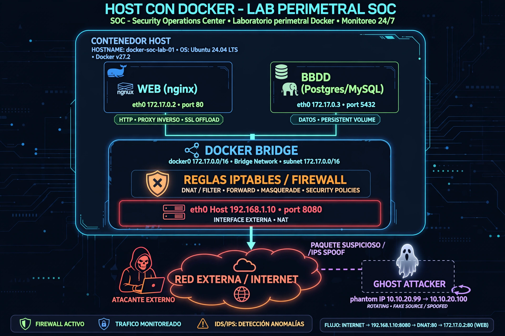

# Lab 02 - Red Perimetral + Ghost Attacker 🛡️



> Laboratorio SOC L1 - Red perimetral Docker con IP fantasma rotativa para validar reglas Risk-Based Priority.

## Arquitectura
- **perimetral**: Open Collector + victima (WEB nginx 172.17.0.2:80 + BBDD Postgres/MySQL 172.17.0.3:5432)
- **soc_interno (internal)**: Wazuh SIEM
- **ghost_net**: Ghost Attacker (IP fantasma)

**Flujo:** WEB + BBDD -> DOCKER BRIDGE (172.17.0.0/16) -> REGLAS IPTABLES DNAT/FILTER/FORWARD -> eth0 Host 192.168.1.10:8080 -> RED EXTERNA / INTERNET -> GHOST ATTACKER

## 🛡️ Cómo aplicarlo - Protección Perimetral con Salto de IP Fantasma

**1. Protección perimetral normal:**
El trafico de internet entra por `eth0 Host 192.168.1.10:8080`, pasa por `DOCKER BRIDGE` y las `REGLAS IPTABLES / FIREWALL (DNAT/FILTER/FORWARD/MASQUERADE)` y llega al contenedor WEB victima.

**2. Detección del ataque:**
Wazuh SIEM (en red interna `soc_interno`) está monitorizando los logs de nginx `/var/log/nginx/access.log`. Si detecta un ataque (ej: muchos 401, 403, brute force T1110.001), genera una alerta.

**3. Salto de IP fantasma (defensa activa):**
Cuando Wazuh detecta el ataque, ejecuta automáticamente `rotate-ghost-ip.sh` como respuesta activa:
- Desconecta el contenedor `ghost-attacker` de `ghost_net`
- Lo reconecta con una IP nueva aleatoria `10.10.20.XX` y alias `ghost-attacker-2`
- El atacante que estaba atacando a `10.10.20.99` de repente ve que la IP ha saltado a `10.10.20.100`
- Mientras, el SIEM registra 2 ofensas del mismo hostname con IP distinta -> Valida la regla Risk-Based Priority.

**Para el atacante:** parece que la victima desapareció o cambió de IP (técnica de decepción / honeypot).
**Para el SOC:** es la prueba de que la correlación de eventos por hostname funciona aunque rote la IP.

## Despliegue
```bash
# 1. Levantar todo
docker-compose up -d

# 2. Crear la IP fantasma inicial
docker network connect --ip 10.10.20.99 ghost_net ghost-attacker --alias ghost-attacker

# 3. Activar la protección que salta al atacar
chmod +x rotate-ghost-ip.sh
./rotate-ghost-ip.sh
# Dejalo corriendo en segundo plano: nohup ./rotate-ghost-ip.sh &

# 4. Simular ataque para que salte
curl http://192.168.1.10:8080/admin -u admin:wrongpass
# Repetir varias veces -> veras como salta la IP
docker network inspect ghost_net | grep IPv4Address
```

## Validacion SOC
- **Wazuh:** 2 ofensas mismo hostname `ghost-attacker`, IP distinta `10.10.20.99` -> `10.10.20.100`
- **MITRE ATT&CK:** T1110.001 (Brute Force) + T1078 (Valid Accounts) + T1205 (Traffic Signaling)
- **Use Case:** Detección de evasión por rotación de IP

## Archivos
- `docker-compose.yml` - Definición de redes perimetral, soc_interno, ghost_net
- `rotate-ghost-ip.sh` - Script de salto de IP fantasma (defensa activa)
- `diagrama-perimetral-moderno.png` - Diagrama de arquitectura

Autor: Iván Ajenjo Morales | Helpdesk L1/L2 -> Junior SecOps | Learning in Public
License: MIT - Ver LICENCIA / LICENSE - Obligatorio mantener autoría si se copia.
