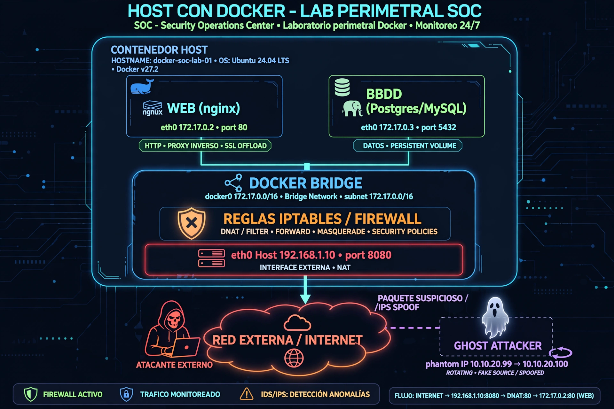

# Lab 02 - Red Perimetral + Ghost Attacker 🛡️



# Lab 02 - Red Perimetral + Ghost Attacker 🛡️


> **Iván Ajenjo Morales | Helpdesk L1/L2 → Junior SecOps**  
> Laboratorio SOC L1 - Red perimetral Docker con IP fantasma rotativa para validar reglas Risk-Based Priority.
> **Técnica clave:** Decepción activa + correlación por hostname cuando el atacante rota IP.

## Arquitectura

- **perimetral**: Open Collector + victima (WEB nginx `172.17.0.2:80` + BBDD Postgres/MySQL `172.17.0.3:5432`)
- **soc_interno (internal)**: Wazuh SIEM
- **ghost_net**: Ghost Attacker `10.10.20.99` → `10.10.20.100` (IP rotativa)

**Flujo:** `WEB + BBDD -> DOCKER BRIDGE (172.17.0.0/16) -> IPTABLES DNAT/FILTER/FORWARD -> eth0 Host 192.168.1.10:8080 -> GHOST ATTACKER`

## 🛡️ Cómo aplicarlo - Protección Perimetral con Salto de IP Fantasma

**1. Protección perimetral normal:** El tráfico entra por `eth0 Host 192.168.1.10:8080`...
**2. Detección:** Wazuh monitoriza `/var/log/nginx/access.log` (401, 403, T1110.001)...
**3. Salto de IP fantasma:** Ejecuta `rotate-ghost-ip.sh` -> Desconecta y reconecta con IP aleatoria `10.10.20.XX`

## 🚀 Despliegue Técnico

### 1. Levantar todo el entorno
### 2. Crear la IP fantasma inicial - una sola vez
### 3. Instalar la defensa activa en Wazuh - NO es nohup
### 4. Simular ataque CORREGIDO para forzar el salto
### 5. Validar que saltó


> Laboratorio SOC L1 - Red perimetral Docker con IP fantasma rotativa para validar reglas Risk-Based Priority.

## Arquitectura
- **perimetral**: Open Collector + victima (WEB nginx 172.17.0.2:80 + BBDD Postgres/MySQL 172.17.0.3:5432)
- **soc_interno (internal)**: Wazuh SIEM
- **ghost_net**: Ghost Attacker (IP fantasma)

**Flujo:** WEB + BBDD -> DOCKER BRIDGE (172.17.0.0/16) -> REGLAS IPTABLES DNAT/FILTER/FORWARD -> eth0 Host 192.168.1.10:8080 -> RED EXTERNA / INTERNET -> GHOST ATTACKER

## 🛡️ Cómo aplicarlo - Protección Perimetral con Salto de IP Fantasma

**1. Protección perimetral normal:**
El trafico de internet entra por `eth0 Host 192.168.1.10:8080`, pasa por `DOCKER BRIDGE` y las `REGLAS IPTABLES / FIREWALL (DNAT/FILTER/FORWARD/MASQUERADE)` y llega al contenedor WEB victima.

**2. Detección del ataque:**
Wazuh SIEM (en red interna `soc_interno`) está monitorizando los logs de nginx `/var/log/nginx/access.log`. Si detecta un ataque (ej: muchos 401, 403, brute force T1110.001), genera una alerta.

**3. Salto de IP fantasma (defensa activa):**
Cuando Wazuh detecta el ataque, ejecuta automáticamente `rotate-ghost-ip.sh` como respuesta activa:
- Desconecta el contenedor `ghost-attacker` de `ghost_net`
- Lo reconecta con una IP nueva aleatoria `10.10.20.XX` y alias `ghost-attacker-2`
- El atacante que estaba atacando a `10.10.20.99` de repente ve que la IP ha saltado a `10.10.20.100`
- Mientras, el SIEM registra 2 ofensas del mismo hostname con IP distinta -> Valida la regla Risk-Based Priority.

**Para el atacante:** parece que la victima desapareció o cambió de IP (técnica de decepción / honeypot).
**Para el SOC:** es la prueba de que la correlación de eventos por hostname funciona aunque rote la IP.

## Despliegue Técnico


# 1. Levantar todo el entorno
docker compose up -d
docker ps

# 2. Crear la IP fantasma inicial - una sola vez
docker network connect --ip 10.10.20.99 ghost_net ghost-attacker --alias ghost-attacker
docker network inspect ghost_net | grep -A2 ghost-attacker

# 3. Instalar la defensa activa en Wazuh - NO es nohup
sudo cp rotate-ghost-ip.sh /var/ossec/active-response/bin/
sudo chmod 750 /var/ossec/active-response/bin/rotate-ghost-ip.sh
sudo chown root:wazuh /var/ossec/active-response/bin/rotate-ghost-ip.sh
sudo systemctl restart wazuh-manager

# Verificar que Wazuh lo ve:
# /var/ossec/bin/wazuh-control test config

# 4. Simular ataque CORREGIDO para forzar el salto
# Esto genera 1x 401 + 12x 404 con el mismo hostname = dispara 100202
curl http://192.168.1.10:8080/admin -u admin:wrongpass
for i in {1..12}; do curl -s -o /dev/null http://192.168.1.10:8080/noexiste$i -H "User-Agent: ghost-attacker" -H "X-Forwarded-For: ghost-attacker"; done

# 5. Validar que saltó
echo "--- IP antes ---"
docker network inspect ghost_net | grep IPv4Address
echo "--- Log de Wazuh ---"
sudo tail -f /var/ossec/logs/alerts/alerts.log | grep 100202
sudo cat /var/ossec/logs/active-responses.log
echo "--- IP después ---"
docker network inspect ghost_net | grep -A2 ghost-attacker

## 🛠️ Anexo: Comandos CLI para Despliegue Automatizado (Laboratorio 02)

Para agilizar el despliegue del entorno perimetral y la configuración de la red defensiva/atacante sin realizar configuraciones manuales, copia y ejecuta directamente los siguientes bloques de comandos en la terminal de tu máquina host.

### 💻 1. Levantar el entorno completo de Contenedores:
```bash
# Iniciar todos los servicios definidos (Web, DB, Host, Wazuh) en segundo plano
docker compose up -d

# Verificar el estado de ejecución y puertos asignados de los contenedores
docker ps
```

### 💻 2. Aprovisionamiento de la Red e IP Fantasma del Atacante (Solo una vez):
```bash
# Conectar el contenedor del atacante asignándole la IP estática simulada dentro de ghost_net
docker network connect --ip 10.10.20.99 ghost_net ghost-attacker --alias ghost-attacker

# Inspeccionar la red para validar que el direccionamiento y alias se aplicaron correctamente
docker network inspect ghost_net | grep -A2 ghost-attacker
```

### 💻 3. Despliegue e Integración de la Defensa Activa en Wazuh:
```bash
# Copiar el script de respuesta activa al directorio de ejecución de Wazuh
sudo cp rotate-ghost-ip.sh /var/ossec/active-response/bin/

# Asignar permisos de ejecución restrictivos al script
sudo chmod 750 /var/ossec/active-response/bin/rotate-ghost-ip.sh

# Cambiar el propietario del script al usuario y grupo del servicio Wazuh
sudo chown root:wazuh /var/ossec/active-response/bin/rotate-ghost-ip.sh

# Reiniciar el gestor de Wazuh para aplicar las nuevas directivas de defensa activa
sudo systemctl restart wazuh-manager
```


#Autor: Iván Ajenjo Morales | Helpdesk L1/L2 -> Junior SecOps 
License: MIT - Ver LICENCIA / LICENSE - Obligatorio mantener autoría si se copia.

```
## Validacion SOC
- **Wazuh:** 2 ofensas mismo hostname `ghost-attacker`, IP distinta `10.10.20.99` -> `10.10.20.100`
- **MITRE ATT&CK:** T1110.001 (Brute Force) + T1078 (Valid Accounts) + T1205 (Traffic Signaling)
- **Use Case:** Detección de evasión por rotación de IP

## Archivos
- `docker-compose.yml` - Definición de redes perimetral, soc_interno, ghost_net
- `rotate-ghost-ip.sh` - Script de salto de IP fantasma (defensa activa)
- `diagrama-perimetral-moderno.png` - Diagrama de arquitectura
